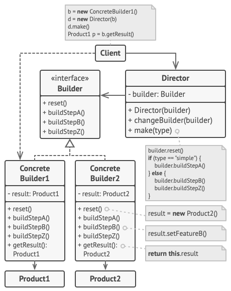
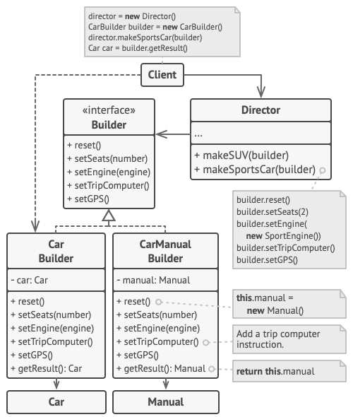

# Builder Design Pattern

## Definition

Builder is a creational design pattern that lets you construct complex objects step by step. The pattern allows you to produce different types and representations of an object using the same construction code.

## Example
### Car factory

Example shows that with two implementation of Builder interface we can easily build a car and a manual for our car.

All is orchestrated with Director class, which depending on given builder will produce manual or a physical car.
Example also have a distinction on the type of car we want to produce (sport, city, suv).

## Other

- Example is from awesome website [Refactoring Guru](https://refactoring.guru)
- There is another example attached from Hyperskill

